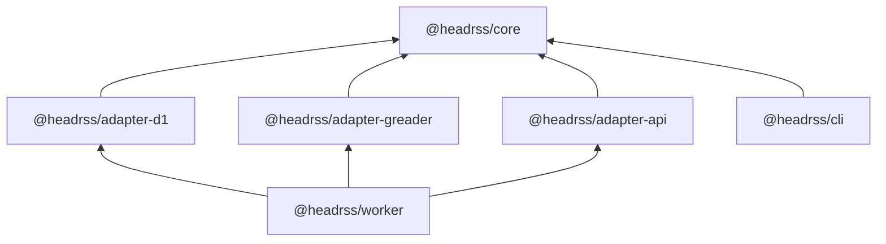
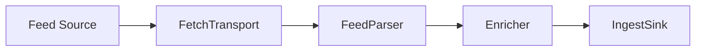

# Architecture

HeadRSS is a self-hosted, headless RSS sync backend built on Cloudflare. It consists of three components:

- **Cloudflare Worker**: stores data in D1 and serves Google Reader-compatible and native REST APIs to RSS clients.
- **CLI**: manages users, feeds, passwords, and subscriptions.
- **Feed fetcher** (part of the CLI): periodically fetches RSS/Atom feeds and pushes parsed items into the Worker.

## Tech Stack

| Layer | Technologies |
|---|---|
| Monorepo | pnpm workspaces, TypeScript (strict), Biome (lint + format), Vitest |
| Worker | Cloudflare Workers, D1 (SQLite), Hono, @hono/zod-openapi, @hono/swagger-ui, Zod |
| Core | Zod, fast-xml-parser |
| CLI | Bun runtime, Commander.js, p-limit |

## System Overview

HeadRSS splits work across two loosely coupled runtimes for portability and extensibility. The Worker handles API requests and data storage, while the CLI handles feed fetching and admin operations on your own server. The two sides communicate only over HTTP, so either can be replaced independently. The fetcher can be extended with capabilities like full-text extraction for truncated feeds, LLM-powered summarization without touching the Worker.

```
┌─────────────────────────────────┐     ┌──────────────────────────────────────┐
│  Your server (CLI)              │     │  Cloudflare (Worker + D1)            │
│                                 │     │                                      │
│  cron -> headrss feed fetch     │     │  /api/google/*  <- RSS clients       │
│    ├─ GET  /admin/feeds ────────┼────>│  /api/native/*  <- web frontend      │
│    ├─ fetch RSS/Atom feeds      │     │  /ingest/*      <- fetcher push      │
│    └─ POST /ingest/items ───────┼────>│  /admin/*       <- admin/fetcher     │
│                                 │     │         │                            │
│  cron -> headrss feed purge ────┼────>│         v                            │
│                                 │     │        D1 (SQLite)                   │
│  headrss feed list/add/rm       │     │                                      │
│  headrss user list/add/rm       │     │                                      │
│  headrss password list/add/rm   │     │                                      │
│  headrss opml import/export     │     │                                      │
└─────────────────────────────────┘     └──────────────────────────────────────┘
         connected only by HTTP APIs
```

## Separation of Concerns

Clean separation of concerns keeps HeadRSS portable and extensible:

- Core business logic has no dependencies on Cloudflare, Hono, or any specific database.
- Storage backends can be swapped by writing a new adapter.
- Protocol adapters (Google Reader, native REST) are independent of each other.

### Core + Ports/Adapters

The `@headrss/core` package is protocol-neutral. All external dependencies are abstracted behind port interfaces defined in `core/src/ports/`:

| Port | Responsibility |
|---|---|
| `EntryStore` | Feeds, entries, subscriptions, labels, users, state |
| `AuthProvider` | Validate username/password credentials |
| `TokenSigner` | Stateless HMAC sign/verify |
| `FeedCredentialStore` | Per-feed encrypted auth credentials |
| `FetchTransport` | HTTP fetch abstraction (URL -> response) |
| `FeedParser` | RSS/Atom XML -> normalized items |
| `Enricher` | Content enrichment pipeline (feed + items -> feed + items) |
| `IngestSink` | Push parsed items to backend |
| `OnFeedSubscribed` | Callback when a new feed is subscribed |

Adapters implement these interfaces. The D1 adapter (`@headrss/adapter-d1`) implements `EntryStore` and `FeedCredentialStore`. Protocol adapters (`@headrss/adapter-greader`, `@headrss/adapter-api`) translate between protocol-specific terms and core domain operations. Swapping D1 for another database means writing a new adapter that satisfies the same port interfaces.

### Domain Vocabulary

Core uses its own domain vocabulary so it stays independent of any particular protocol. Adapters translate to and from protocol-specific terms at the boundary.

| Core (domain-neutral) | Google Reader term | Native API term |
|---|---|---|
| Entry | item | entry |
| Feed | subscription | feed |
| Label | tag / label | folder / label |
| Subscription | subscription | subscription |
| list-entry-ids | stream/items/ids | GET /entries?fields=id |
| list-entries | stream/contents | GET /entries |
| get-entries-by-id | stream/items/contents | GET /entries?ids=... |
| list-subscriptions | subscription/list | GET /subscriptions |
| list-labels | tag/list | GET /folders |
| mark-entries | edit-tag | PUT /entries/:id |
| mark-all-read | mark-all-as-read | POST /subscriptions/:id/mark-all-read |


## API Namespaces

The Worker organizes its routes into four namespaces, each with distinct auth and purpose.

```
headrss.example.com
  /api/google/*              Google Reader compatible API
  /api/native/v0/*           Native REST API (CLI user commands, web frontends, etc.)
  /ingest/*                  Item ingestion (INGEST_API_KEY)
  /admin/*                   User/feed/credential management (FETCH_API_KEY read-only, ADMIN_API_KEY full)
```

Additional utility routes: `/health` (health check), `/api/openapi.json` (OpenAPI spec), `/api/docs` (Swagger UI).

See the [API Reference](api.md) for full endpoint details.

## Package Structure

Six packages with strict dependency direction. Core has zero runtime dependencies on adapters or framework code.



Workspace layout:

```
packages/
  core/                 @headrss/core
  adapter/
    d1/                 @headrss/adapter-d1
    greader/            @headrss/adapter-greader
    api/                @headrss/adapter-api
  worker/               @headrss/worker
  cli/                  @headrss/cli
```

Configured via `pnpm-workspace.yaml` with globs `packages/*` and `packages/adapter/*`.

## How the Worker Starts

The Worker entry point is `packages/worker/src/index.ts`. When a request arrives, the Worker creates all its dependencies from D1 bindings and environment secrets, then mounts the route handlers.

First it builds the concrete implementations of each port: `D1EntryStore` and `D1CredentialStore` for storage, `LocalAuthProvider` for username/password validation, and `HmacTokenSigner` for stateless token operations. It also creates the `onFeedSubscribed` callback that triggers fetch-on-subscribe (see below).

With those dependencies in hand, the Worker constructs the four route groups: the Google Reader adapter, the native REST API adapter, the ingest routes (guarded by `INGEST_API_KEY`), and the admin routes (guarded by scoped admin auth). Each group is mounted at its URL prefix:

```
/api/google     -> greader adapter
/api/native/v0  -> native API adapter
/ingest         -> ingest routes
/admin          -> admin routes
```

Worker secrets (see [Configuration](configuration.md) for setup):

| Secret | Purpose |
|---|---|
| `TOKEN_KEY` | HMAC-SHA256 token signing (auth + CSRF) |
| `CREDENTIAL_KEY` | AES-GCM encryption of feed credentials |
| `INGEST_API_KEY` | Fetcher push access (`/ingest/*`) |
| `FETCH_API_KEY` | Fetcher read-only access (`GET /admin/feeds`, credentials) |
| `ADMIN_API_KEY` | Full admin access (`/admin/*`) |

## Feed Pipeline

The CLI fetcher (`headrss feed fetch`), typically invoked by cron, drives the feed update cycle. It pulls the list of due feeds from the Worker, fetches those feeds directly from their RSS/Atom sources, parses the XML into normalized items, and pushes the results back to the Worker's ingest API for storage. The Worker itself never contacts external feed sources (except for [fetch-on-subscribe](api.md#fetch-on-subscribe)).

### Pipeline Stages

The pipeline processes each feed through a series of stages, each defined by a port interface with a concrete adapter implementation.




For each feed, the pipeline:

1. **Pulls** due feeds and prefetches credentials from the Worker API.
2. **Fetches** the feed with conditional headers (`If-None-Match`, `If-Modified-Since`), feed credentials if configured, and `User-Agent: HeadRSS-Fetcher/1.0`.
3. Handles response status (304 not modified, 410 gone, 429 rate limited, 4xx/5xx errors).
4. Parses feed XML into normalized items.
5. Enriches items (discovers favicon from `site_url`).
6. Deduplicates items by `guid:publishedAt`.
7. **Pushes items to the Worker** via the ingest API in batches.
8. Updates feed metadata on the Worker (etag, last-modified, title, site_url, favicon_url, fetch state) via the ingest API.
9. On permanent redirects (301), updates the canonical feed URL on the Worker.

### Concurrency and Rate Limiting

The fetcher balances throughput with politeness to upstream servers.

- **Cross-domain parallel**: up to `FETCH_CONCURRENCY` domains processed in parallel (default 8, configurable via env var).
- **Per-domain serial**: feeds on the same domain are fetched sequentially with a 2-second gap between requests.
- **Implementation**: feeds are grouped by hostname, and each domain group runs serially within a `p-limit` concurrency slot.

### Error Handling and Backoff

When a feed fails to fetch, the Worker applies exponential backoff persisted as `next_fetch_at`. The formula is `min(5 * 3^(n-1) minutes, 24 hours)`.

| Consecutive failures | Backoff |
|---|---|
| 1 | 5 min |
| 2 | 15 min |
| 3 | 45 min |
| 4 | ~2.25 hours |
| 5 | ~6.75 hours |
| 6+ | 24 hours (cap) |

Constants from `core/constants.ts`: `BACKOFF_BASE_MINUTES = 5`, `BACKOFF_MULTIPLIER = 3`, `BACKOFF_CAP_HOURS = 24`.

Special cases:

| Condition | Behavior |
|---|---|
| `fetch_error_count = -1` | Dead feed (410 Gone). Fetcher skips entirely. Admin can reset via `PUT /admin/feeds/:id` or delete and re-register. |
| `fetch_error_count = 0` | Healthy feed. Fetch on normal interval (`FETCH_INTERVAL`, default 900s). |
| 429 with Retry-After | Uses the larger of Retry-After and computed backoff. |
| 410 Gone | Sets `next_fetch_at` ~10 years in the future. |

Sink retries (pushing items to Worker): up to 3 attempts per batch with 1s/2s/4s backoff. Items are chunked into batches of 40 (`INGEST_BATCH_SIZE`). On 207 partial response, only failed chunks are retried.

### Content Processing

All processing happens in the fetcher before pushing to the ingest API.

| Step | Rule |
|---|---|
| Content truncation | `content` <= 512 KB (`MAX_CONTENT_SIZE`), `summary` <= 4 KB (`MAX_SUMMARY_SIZE`) |
| Date normalization | Parse RFC 822 / RFC 3339 / ISO 8601 / loose formats to UNIX seconds. Fall back to current time. |
| GUID normalization | `<guid>` / `<id>` element, fall back to item URL, fall back to hash of title + published_at |
| Relative URL resolution | Resolve relative URLs in content, summary, and item URL against feed link |
| HTML content | Passed through as-is. Sanitized at render time, not at ingest. |
| `public_id` generation | NOT done by fetcher. Fetcher sends `guid` only. Worker computes deterministic hash at ingest via `core/id.ts`. |

## Cloudflare Free-Tier Constraints

HeadRSS is designed to run within Cloudflare's free tier where possible, though the Workers Paid plan ($5/mo) is the realistic baseline for production use.

| Resource | Free limit | Mitigation |
|---|---|---|
| Worker requests | 100k/day | Sufficient for personal use. Cursor model avoids extra state writes. |
| Worker CPU | 10 ms/request | Tight for hot paths (unread counts, joins). Default page size capped at 200 items (`MAX_PAGE_SIZE`). Admin/maintenance endpoints likely exceed 10 ms. |
| D1 rows read | 5M/day | Composite indexes, sparse `item_states`, keyset pagination. |
| D1 rows written | 100k/day | Batch inserts (`INGEST_BATCH_SIZE = 40`), cursor model (mark-all-read = cursor update + override cleanup). |
| D1 storage | 500 MB/DB | Retention purge via `headrss feed purge` (default 90 days, preserves starred). Content capped at 512 KB/item. |
| D1 row size | 2 MB max | Content <= 512 KB + summary <= 4 KB. Enforced at ingest. |
| D1 queries/invocation | 50 | Chunk large ID lists, batch operations. |
| D1 bound params | 100/query | Chunk entry-by-ID requests at ~90 IDs per batch (`ENTRIES_PER_BATCH_QUERY = 90`). |
