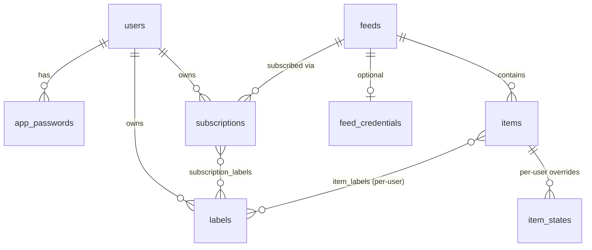

# Data Model

## Overview

HeadRSS stores all persistent state in a single Cloudflare D1 (SQLite) database.
The schema comprises 11 tables covering users, authentication, feeds, subscriptions,
items, read/star state, labels, feed credentials, and rate limiting. All timestamps
are stored as UNIX seconds (INTEGER). Foreign keys are enforced (`PRAGMA foreign_keys = ON`).
Understanding this schema is important because it drives the read model, sync behavior,
and retention rules that underpin the entire system.

Source: [`packages/adapter/d1/src/migrations/0001_init.sql`](../packages/adapter/d1/src/migrations/0001_init.sql)

## Entity Relationships

The tables form a graph rooted at `users` and `feeds`. The diagram below shows the primary relationships.



| Table | What it represents |
|---|---|
| **users** | Registered user accounts. |
| **app_passwords** | Per-device credentials (one per RSS client or CLI instance). |
| **feeds** | Global feed registry. A feed URL is shared across all subscribers. |
| **subscriptions** | Links a user to a feed. Holds the read cursor for that user's read state. |
| **labels** | Shared namespace for both folders (on subscriptions) and tags (on items). |
| **subscription_labels** | Join table assigning labels to subscriptions (folders). |
| **item_labels** | Join table assigning labels to items (per-user tags). |
| **items** | Individual feed entries, belonging to a feed. |
| **item_states** | Sparse per-user read/star overrides against the read cursor. Most items have no row here. |
| **feed_credentials** | Encrypted auth credentials for fetching protected feeds. At most one per feed. |
| **rate_limits** | Per-IP authentication rate limiting counters (standalone, not linked to other tables). |

## Tables

### users

The root identity table. Each user authenticates via one or more app passwords and
owns subscriptions, labels, and item states.

| Column       | Type    | Constraints           | Notes                                          |
|--------------|---------|-----------------------|------------------------------------------------|
| `id`         | INTEGER | PRIMARY KEY           | Autoincrement rowid                            |
| `username`   | TEXT    | NOT NULL, UNIQUE      |                                                |
| `email`      | TEXT    | UNIQUE                | Nullable. Used for GR `user-info` `userEmail`  |
| `created_at` | INTEGER | NOT NULL              | UNIX seconds                                   |

### app_passwords

Per-device credentials for ClientLogin and native API token auth. One user can have
multiple app passwords (e.g., one per RSS client). This table enables fine-grained
credential rotation without disrupting other connected clients.

| Column             | Type    | Constraints                                    | Notes                        |
|--------------------|---------|------------------------------------------------|------------------------------|
| `id`               | INTEGER | PRIMARY KEY                                    |                              |
| `user_id`          | INTEGER | NOT NULL, FK -> users(id) ON DELETE CASCADE    |                              |
| `label`            | TEXT    | NOT NULL                                       | Human-readable device name   |
| `password_hash`    | TEXT    | NOT NULL                                       | PBKDF2-SHA256 hash           |
| `password_version` | INTEGER | NOT NULL                                       | Increment on rotation        |
| `last_used_at`     | INTEGER |                                                | UNIX seconds, nullable       |
| `created_at`       | INTEGER | NOT NULL                                       | UNIX seconds                 |

### feeds

Global feed registry. A feed URL is a unique identity: feeds are shared across users
so that a single fetch serves all subscribers.

| Column              | Type    | Constraints      | Notes                                              |
|---------------------|---------|------------------|----------------------------------------------------|
| `id`                | INTEGER | PRIMARY KEY      |                                                    |
| `url`               | TEXT    | NOT NULL, UNIQUE | Canonical feed URL                                 |
| `title`             | TEXT    |                  | From feed metadata                                 |
| `site_url`          | TEXT    |                  | Website home page                                  |
| `favicon_url`       | TEXT    |                  | Stored as URL, not blob                            |
| `etag`              | TEXT    |                  | For conditional fetch (If-None-Match)              |
| `last_modified`     | TEXT    |                  | For conditional fetch (If-Modified-Since)          |
| `last_fetched_at`   | INTEGER |                  | UNIX seconds, nullable. Last successful fetch      |
| `fetch_error_count` | INTEGER | NOT NULL, DEFAULT 0 | Consecutive failures. -1 = dead feed sentinel   |
| `next_fetch_at`     | INTEGER |                  | UNIX seconds, nullable. Earliest next fetch time   |
| `created_at`        | INTEGER | NOT NULL         | UNIX seconds                                       |
| `updated_at`        | INTEGER | NOT NULL         | UNIX seconds                                       |

### subscriptions

Links a user to a feed. The `read_cursor_item_id` column is the high-water mark for
the cursor-plus-exceptions read model (see [Design Decisions](#cursor-plus-exceptions-read-model)).

| Column                 | Type    | Constraints                                    | Notes                                      |
|------------------------|---------|------------------------------------------------|--------------------------------------------|
| `id`                   | INTEGER | PRIMARY KEY                                    |                                            |
| `user_id`              | INTEGER | NOT NULL, FK -> users(id) ON DELETE CASCADE    |                                            |
| `feed_id`              | INTEGER | NOT NULL, FK -> feeds(id) ON DELETE CASCADE    |                                            |
| `custom_title`         | TEXT    |                                                | User-facing title override                 |
| `read_cursor_item_id`  | INTEGER |                                                | Nullable. Items with `id <= cursor` = read |
| _(unique)_             |         | UNIQUE (user_id, feed_id)                      |                                            |

### labels

Shared namespace for folders (on subscriptions) and item labels/tags. One row
serves both contexts, matching Google Reader's `user/-/label/X` model.

| Column    | Type    | Constraints                                    | Notes            |
|-----------|---------|------------------------------------------------|------------------|
| `id`      | INTEGER | PRIMARY KEY                                    |                  |
| `user_id` | INTEGER | NOT NULL, FK -> users(id) ON DELETE CASCADE    |                  |
| `name`    | TEXT    | NOT NULL                                       |                  |
| _(unique)_|         | UNIQUE (user_id, name)                         |                  |

### subscription_labels

M:N join between subscriptions and labels. A subscription can be in multiple folders.

| Column            | Type    | Constraints                                             | Notes |
|-------------------|---------|---------------------------------------------------------|-------|
| `subscription_id` | INTEGER | NOT NULL, FK -> subscriptions(id) ON DELETE CASCADE     |       |
| `label_id`        | INTEGER | NOT NULL, FK -> labels(id) ON DELETE CASCADE            |       |
| _(pk)_            |         | PRIMARY KEY (subscription_id, label_id)                 |       |

**Ownership invariant:** The label's `user_id` must match the subscription's `user_id`.
Enforced at the application layer (core commands validate before insert) since SQLite
cannot express cross-table column constraints.

### items

Feed entries. Each item has a deterministic `public_id` (see [Public Item IDs](#public-item-ids))
and a `(feed_id, guid)` uniqueness constraint for deduplication at ingest.

| Column         | Type    | Constraints                                    | Notes                          |
|----------------|---------|------------------------------------------------|--------------------------------|
| `id`           | INTEGER | PRIMARY KEY                                    | Autoincrement, monotonic       |
| `public_id`    | TEXT    | NOT NULL, UNIQUE                               | 22-char base62, deterministic  |
| `feed_id`      | INTEGER | NOT NULL, FK -> feeds(id) ON DELETE CASCADE    |                                |
| `guid`         | TEXT    | NOT NULL                                       | From feed entry                |
| `title`        | TEXT    |                                                |                                |
| `url`          | TEXT    |                                                | Permalink                      |
| `author`       | TEXT    |                                                |                                |
| `content`      | TEXT    |                                                | Hard cap: 512 KB               |
| `summary`      | TEXT    |                                                | Hard cap: 4 KB                 |
| `published_at` | INTEGER | NOT NULL                                       | UNIX seconds                   |
| `crawl_time_ms`| INTEGER |                                                | Fetch duration in milliseconds |
| `created_at`   | INTEGER | NOT NULL                                       | UNIX seconds                   |
| _(unique)_     |         | UNIQUE (feed_id, guid)                         |                                |

### item_states

Sparse exceptions table for per-user read/star state. Rows only exist when they
override the cursor or record a star. Most items have no row here.

| Column       | Type    | Constraints                                    | Notes                                                              |
|--------------|---------|------------------------------------------------|--------------------------------------------------------------------|
| `item_id`    | INTEGER | NOT NULL, FK -> items(id) ON DELETE CASCADE    |                                                                    |
| `user_id`    | INTEGER | NOT NULL, FK -> users(id) ON DELETE CASCADE    |                                                                    |
| `is_read`    | INTEGER |                                                | Nullable. `1` = read override, `0` = unread override, NULL = defer |
| `is_starred` | INTEGER | NOT NULL, DEFAULT 0                            | `0` or `1`                                                         |
| `starred_at` | INTEGER |                                                | UNIX seconds, nullable                                             |
| _(pk)_       |         | PRIMARY KEY (item_id, user_id)                 |                                                                    |
| _(check)_    |         | CHECK (is_read IN (0, 1) OR is_read IS NULL)   |                                                                    |
| _(check)_    |         | CHECK (is_starred IN (0, 1))                   |                                                                    |

### item_labels

M:N join between items and labels, scoped per user. Represents custom tags applied to
individual items (Google Reader's `edit-tag` with `user/-/label/*`).

| Column    | Type    | Constraints                                    | Notes |
|-----------|---------|------------------------------------------------|-------|
| `user_id` | INTEGER | NOT NULL, FK -> users(id) ON DELETE CASCADE    |       |
| `item_id` | INTEGER | NOT NULL, FK -> items(id) ON DELETE CASCADE    |       |
| `label_id`| INTEGER | NOT NULL, FK -> labels(id) ON DELETE CASCADE   |       |
| _(pk)_    |         | PRIMARY KEY (user_id, item_id, label_id)       |       |

**Ownership invariant:** `label_id` must reference a label with matching `user_id`.
Enforced at the application layer.

### feed_credentials

Encrypted per-feed authentication credentials. Each feed has at most one credential
row. If a feed requires different credentials for different users, register separate
feed URLs.

| Column                   | Type    | Constraints                                    | Notes                                    |
|--------------------------|---------|------------------------------------------------|------------------------------------------|
| `id`                     | INTEGER | PRIMARY KEY                                    |                                          |
| `feed_id`                | INTEGER | NOT NULL, UNIQUE, FK -> feeds(id) ON DELETE CASCADE |                                   |
| `auth_type`              | TEXT    | NOT NULL                                       | `basic`, `bearer`, or `custom`           |
| `credentials_encrypted`  | BLOB    | NOT NULL                                       | AES-GCM encrypted with `CREDENTIAL_KEY` |
| `created_at`             | INTEGER | NOT NULL                                       | UNIX seconds                             |

### rate_limits

Per-IP authentication rate limiting. Rows are upserted on failed auth attempts and
cleaned up during purge cycles.

| Column         | Type    | Constraints          | Notes                                          |
|----------------|---------|----------------------|------------------------------------------------|
| `ip`           | TEXT    | NOT NULL             | Client IP address                              |
| `endpoint`     | TEXT    | NOT NULL             | e.g., `ClientLogin`, `auth/token`              |
| `window_start` | INTEGER | NOT NULL             | UNIX seconds, start of 15-minute window        |
| `attempts`     | INTEGER | NOT NULL             | Failed attempts in current window               |
| _(pk)_         |         | PRIMARY KEY (ip, endpoint) |                                           |

## Indexes

All explicit indexes defined in the migration, grouped by purpose.

### Hot-path reads

| Index                          | Columns                                    | Notes                                      |
|--------------------------------|--------------------------------------------|--------------------------------------------|
| `idx_items_feed_published`     | `items(feed_id, published_at DESC, id DESC)` | Stream listing: items by feed, newest first |
| `idx_subscriptions_user`       | `subscriptions(user_id)`                   | List subscriptions for a user              |
| `idx_subscriptions_user_feed`  | `subscriptions(user_id, feed_id)`          | Look up a specific subscription            |
| `idx_feeds_next_fetch`         | `feeds(next_fetch_at)`                     | Schedule query: find feeds due for fetch   |

Implicit indexes from UNIQUE constraints: `users(username)`, `users(email)`, `feeds(url)`,
`items(public_id)`, `items(feed_id, guid)`, `feed_credentials(feed_id)`.

### State lookups (the sparse table keeps these indexes small)

| Index                                | Columns                            | Filter                    | Notes                              |
|--------------------------------------|------------------------------------|---------------------------|------------------------------------|
| `idx_item_states_user_item`          | `item_states(user_id, item_id)`    |                           | Look up state for a specific item  |
| `idx_item_states_user_read_override` | `item_states(user_id, is_read)`    | `WHERE is_read IS NOT NULL` | Find all read/unread overrides   |
| `idx_item_states_user_starred`       | `item_states(user_id, is_starred)` | `WHERE is_starred = 1`    | List starred items                 |

### Label lookups

| Index                          | Columns                        | Notes                              |
|--------------------------------|--------------------------------|------------------------------------|
| `idx_subscription_labels_label`| `subscription_labels(label_id)`| Find subscriptions for a label     |
| `idx_item_labels_user_item`    | `item_labels(user_id, item_id)`| Labels for a specific item         |
| `idx_item_labels_label`        | `item_labels(label_id)`        | Find items with a label            |
| `idx_labels_user`              | `labels(user_id)`              | List labels for a user             |

### Purge scan

| Index                 | Columns               | Notes                                  |
|-----------------------|-----------------------|----------------------------------------|
| `idx_items_published` | `items(published_at)` | Range scan for retention-based cleanup |

### App password lookups

| Index                     | Columns                  | Notes                          |
|---------------------------|--------------------------|--------------------------------|
| `idx_app_passwords_user`  | `app_passwords(user_id)` | Find passwords for a user      |

## Design Decisions

### Public Item IDs

Protocol adapters expose item IDs to external clients, and reimporting feeds or
rebuilding the database should not change those IDs. To meet this requirement,
items are referenced externally by `public_id`, never by the internal autoincrement `id`.

**Generation algorithm** (implemented in `packages/core/src/id.ts`):

1. Compute SHA-256 of `feed.url` + `":"` + `guid`
2. Take the first 16 bytes (128 bits) of the digest
3. Encode as base62 (alphanumeric), zero-padded to 22 characters

**Properties:**

- **Deterministic**: the same feed URL and GUID always produce the same public ID.
  This means IDs survive reimports, database rebuilds, and storage migrations.
- **Uses `feed.url`** (not autoincrement `feed_id`) as the hash input, so the ID is
  independent of internal database state.
- **128-bit collision space**: negligible collision probability at personal/small scale
  (~2^64 items before birthday-bound concern).
- **Generated server-side only** at ingest time. The CLI sends raw `guid`; the Worker
  looks up `feed.url` and computes the public ID via `core/id.ts`.
- Protocol adapters map between `public_id` and their own format (e.g., Google Reader
  uses 16-character hex IDs). Internal `id` values are converted to hex strings before
  being sent to clients, avoiding precision loss beyond 2^53.

### Cursor-Plus-Exceptions Read Model

Tracking per-user read state for every item would require materializing a state row
for each user on every new item at ingest time, which is expensive and wasteful.
The cursor-plus-exceptions model avoids this.

`subscriptions.read_cursor_item_id` is the high-water mark: all items for a feed with
`items.id <= read_cursor_item_id` are considered read. The `item_states` table stores
only the exceptions (overrides) to this rule. This avoids materializing a state row per
user per item at ingest time.

**Why `items.id` instead of `published_at`?** A `published_at`-based cursor would
silently mark late-arriving, backfilled, or date-corrected items as read, so the user
would never see them. Since `items.id` is assigned at ingest time (monotonically
increasing), new items always land above the cursor regardless of their publication date.

**Override rules:**

| Scenario                                    | Action                                     |
|---------------------------------------------|--------------------------------------------|
| Mark individual read (item `id` > cursor)   | INSERT override with `is_read = 1`         |
| Mark individual unread (item `id` <= cursor) | INSERT override with `is_read = 0`        |
| Starred items                               | Always have a row in `item_states`         |

#### Unread Count Formula

```
unread = (items for feed where id > cursor)
       - (overrides where is_read = 1 AND id > cursor)
       + (overrides where is_read = 0 AND id <= cursor)
```

Computed per request in application logic. Not denormalized in the schema. Cheap
because the exceptions table is small.

#### Mark-All-As-Read Algorithm

Accepts a stream ID (`s`) and optional timestamp (`ts`, UNIX microseconds from the
Google Reader API). Three scopes:

**Single feed** (`s=feed/URL`):

1. Resolve to subscription. Record `old_cursor = COALESCE(read_cursor_item_id, 0)`.
2. Compute `max_item_id`:
   - No `ts`: `MAX(items.id)` for this feed.
   - With `ts`: `MAX(items.id)` for this feed where `published_at <= ts / 1000000`.
3. Advance cursor: `UPDATE subscriptions SET read_cursor_item_id = :max_item_id`.
4. Clean stale overrides (preserve starred rows):
   - Delete non-starred override rows at or below the new cursor.
   - Clear stale `is_read` on starred rows that the cursor now covers (`SET is_read = NULL`).
5. If `ts` was provided, protect items caught under the new cursor that were published
   after the cutoff. Backfilled items with low `published_at` but high `id` can pull
   the cursor past newer-published items that should stay unread:
   ```sql
   INSERT INTO item_states (item_id, user_id, is_read)
   SELECT i.id, :uid, 0
   FROM items i
   WHERE i.feed_id = :fid
     AND i.id > :old_cursor AND i.id <= :max_item_id
     AND i.published_at > :ts_seconds
   ON CONFLICT (item_id, user_id) DO UPDATE SET is_read = 0
   ```

**Label/folder** (`s=user/-/label/NAME`):

1. Find all subscriptions with this label for the user.
2. Apply the single-feed algorithm to each subscription.
3. Batch in `db.batch()` chunks.

**Reading list** (`s=user/-/state/com.google/reading-list`):

1. Apply to all subscriptions for the user.
2. Same per-subscription algorithm, batched in `db.batch()` chunks.

The Native API equivalent (`POST /api/native/v0/subscriptions/:id/mark-all-read`)
is always single-subscription scope with an optional `before` timestamp.

### Labels & Shared Namespace

The `labels` table is M:N with both subscriptions (via `subscription_labels`) and items
(via `item_labels`). This directly maps to Google Reader's `user/-/label/X` tag model,
where a single tag can be applied to both subscriptions and items.

**Vocabulary mapping:**

| Domain (core)            | Google Reader     | Native API |
|--------------------------|-------------------|------------|
| Label on subscription    | `user/-/label/X`  | folder     |
| Label on item            | `user/-/label/X`  | label      |

**Shared namespace rules:** Folders and item labels share `UNIQUE(user_id, name)`.
The Native API exposes two views of the same table:

- `GET /folders` and `GET /labels` both return all labels for the user.
- `POST /folders` and `POST /labels` both create or reuse the same row by `(user_id, name)`.
- `DELETE /folders/:id` removes all `subscription_labels` for this label; deletes the
  label row only if no `item_labels` references remain.
- `DELETE /labels/:id` removes all `item_labels` for this label; deletes the label row
  only if no `subscription_labels` references remain.

A user can have a folder and item label both named "Work" because they are the same
underlying label row, applied in both contexts. Deleting the folder unassigns it from
subscriptions but preserves the label if it is still applied to items.

### Feed Credentials Encryption

- Stored as `credentials_encrypted` (BLOB), encrypted with AES-GCM using the Worker
  secret `CREDENTIAL_KEY`.
- The Worker decrypts server-side and serves credentials via
  `GET /admin/feeds/:id/credentials` (requires `FETCH_API_KEY` or `ADMIN_API_KEY`).
- Credentials are never exposed in any client-facing (`/api/*`) response.
- One credential per feed. If a feed requires different credentials per user (e.g.,
  per-user API tokens), register separate feed URLs. This keeps items global per feed
  and prevents cross-user data leakage.

### Content Size Limits

| Field           | Limit  | Rationale                            |
|-----------------|--------|--------------------------------------|
| `items.content` | 512 KB | CLI truncates before ingest          |
| `items.summary` | 4 KB   | CLI truncates before ingest          |
| Row total       | < 2 MB | Stays within D1's row size limit     |

Defined in `packages/core/src/constants.ts` as `MAX_CONTENT_SIZE` (524,288 bytes)
and `MAX_SUMMARY_SIZE` (4,096 bytes).

## Retention & Purge

D1 has a 500 MB storage limit, and old items that have already been read consume space
without providing ongoing value. Periodic purging keeps storage under control while
protecting items that users still care about.

Old items are periodically deleted via `POST /admin/maintenance/purge` (called from
`headrss feed purge` on the CLI server's cron schedule).

**Protection rules: an item is never deleted if any of these apply:**

- **Starred**: `item_states.is_starred = 1`
- **Explicitly marked unread**: `item_states.is_read = 0` (user override)
- **Cursor-unread for any subscriber**: `items.id > COALESCE(subscription.read_cursor_item_id, 0)`
  for any subscription to the item's feed. Without this, a user with an unread backlog
  older than the retention window would lose items (cursor-unread items have no
  `item_states` row to protect them).

Items on feeds with no subscribers are eligible for deletion (no one to read them).

**Retention window:** `RETENTION_DAYS` environment variable, default 90 days
(configured in `packages/cli/src/config.ts`).

**Batch deletion strategy** (implemented in `packages/adapter/d1/src/d1-entry-store.ts`):

1. Select candidate item IDs older than the cutoff that are not protected.
2. Delete in batches of `PURGE_BATCH_SIZE` (15) items per `db.batch()` call.
   Each item requires 3 DELETE statements (`item_labels`, `item_states`, `items`),
   so 15 items x 3 = 45 statements, safely under D1's 50 statements-per-batch limit.
3. Each `db.batch()` is atomic (implicit transaction). On partial failure, earlier
   batches are already committed. The loop continues until no more candidates remain.
4. Response includes counts: `{ deleted, skippedStarred, skippedUnreadOverride }`.
